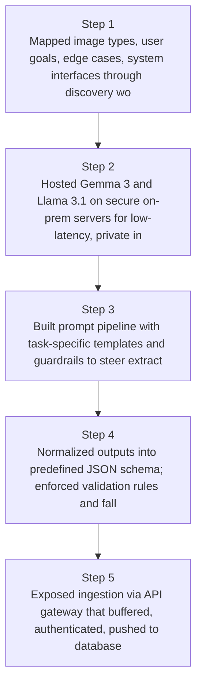
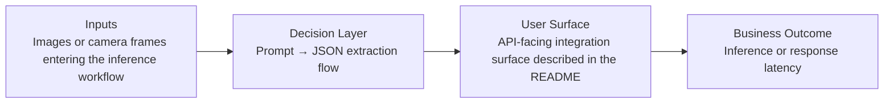
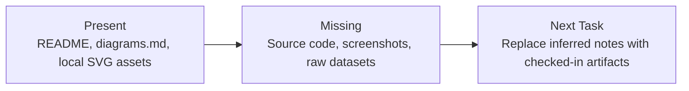

# On-Prem Vision Inference Pipeline Diagrams

Generated on 2026-04-26T04:29:37Z from README narrative plus project blueprint requirements.

## On-prem vision pipeline architecture

## Prompt → JSON extraction flow

## Evidence Gap Map

